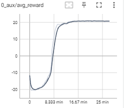
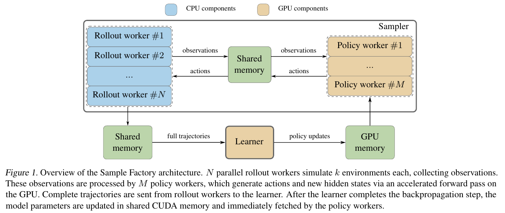

#  AsynRL 

## 背景

异步并行算法库接口AsynRL基于2020年Intel和University of Sourhern Californi的论文《Sample Factory: Egocentric 3D Control From Pixels at 100000 FPS with Asynchronous Reinforcement Learning》提出的[Sample Factory](https://github.com/alex-petrenko/sample-factory)，它是为单机设计的高吞吐训练系统，基于APPO(Asynchronous Proximal PolicyOptimization)算法。能在3D控制场景达到100000 FPS。异步并行算法库接口AsynRL主要是将Sample Factory（1.23.0）接口化，性能与Sample-factory相同，支持APPO、A3C、IMPALA三种异步并行算法。

## 安装
### 主要依赖库版本

Python：3.8

Pythorch：1.6.0

Gym：0.17.2

### 安装流程（linux）

1、下载代码: git clone https://github.com/Garytoner/AsynRL.git

2、创建conda虚拟环境：

cd AsynRL

conda env create -f environment.yml

conda activate AsynRL

## AsynRL使用说明

### 接口形式

model = APPO(env,encoder: str,encodersubtype:str,num_envs_per_worker:int =2,num_workers:int=8,  device: Union[torch.device, str] = "cpu"， policy_kwargs: Optional[Dict[str, Any]] = None)：其中APPO可变换为A3C或IMPALA

### 参数说明

参数 env：训练的环境

参数 encoder：编码器类型

参数 encodersubtype：编码子类型

参数 num_envs_per_worker：单个actor worer 跑的环境数

参数 num_workers：rollout worker 数量

参数 policy_kwargs：其他超参数 

### 获取网络参数

model.GetParameters()

返回值：神经网络参数

### 设置网络参数

model.GetParameters()

返回值：神经网络参数

### 训练

model.train(train_for_env_steps)

参数 train_for_env_steps:一次train的步数 

PS：

异步并行算法库接口AsnyRL具体形式与调用方法可参见main.py。

## AsynRL的train流程

1、首先创建learner对象，然后启动learner进程，在learner进程中，启动了train_loop线程用于计算梯度，更新网络参数；

2、创建policy worker对象，然后启动policy worker进程；

3创建actor worker对象，在初始化对象时，创建了actor worker进程，在创建actor worker对象时，创建了两个env_runner，env_runner负责具体的rollout；

4、首先reset  actor worker，actor_worker向policy_worker中发送请求，policy_worker收到请求后，向actor_worker发送rollout消息，actor_worker收到后进入awaken状态，然后开始rollout；

5、actor_worker运行step后向policy_worker中发送请求，policy_worker收到请求并进行处理后，向actor_worker发送advance_rollout_request消息，actor_worker收到消息处理后运行step后向policy_worker中发送请求，一次完整的rollout结束后，向leraner发送train命令，learner开始准备buffer，并将经验放入buffer中，learner的train_loop周期性的处理数据并更新网络参数。Learner将网络参数放在共享内存中，policy worker 再从共享内存中周期性更新网络参数。

6.train N步后，训练将结束，actor worker  rollout结束后 ，暂停相应的actor worker，所有的actor worker都暂停后，再结束train.

7、一次train结束后，learner将网络参数放在共享内存中，主进程再更新相关网络参数。在每一次train之前可以设置网络参数，设置的参数有state_dict和check_point两种,均为整体网络参数。

## 训练效果及FPS：

下图为异步并行算法库接口AsynRL 在Atari PongNoFrameSkip-V4 1024个环境下， APPO算法 train 16次，每次1000万步的训练的训练效果和FPS。

### 训练效果

    

### FPS

> 

>     
> 

## Sample-Factory介绍

一个典型的强化学习中有三个主要的计算任务：环境仿真，模型推理和反向传播。设计的原则是让最慢的任务不要等其它的任务，因为系统的吞吐取决于最慢任务的吞吐。每种任务对应一种类型的组件。组件之间通过高速的FIFO队列和共享内存通信。三种组件分别为：1) Rollout worker：每个rollout worker可以有多个环境实例，与这些环境交互采集经验。Rollout worker一方面将经验通过共享内存给policy worker，另一方面通过共享内存给learner。2）Policy worker：收集多个rollout worker来的状态，通过策略得到动作，通过共享内存传回给rollout worker。3）Learner：通过共享内存从rollout worker拿到经验轨迹，更新策略，然后通过GPU memory（因policy worker与learner都跑在GPU上）发往policy worker。Policy worker就可以用新的策略生成动作了。Rollout worker和policy worker一起称为sampler子系统。为了解决rollout worker等待policy worker返回动作的问题，使用了Double-Buffered Sampling的技巧。即在rollout worker上存一组环境 ，并分成两组，通过轮流来提高CPU利用率。

    

    

在这个框架中，一次迭代中从并行环境中收集的多个经验轨迹在learner中无法在一次mini-batch中消化掉。这会导致policy lag问题，即behavior policy与target policy的不一致。对PG方法来说这种off-policy学习比较困难。因为policy lag越大，从behavior policy采样来准确估计梯度就越难。减少环境中执行步数或者增大mini-batch size可以减少policy lag。除此之外，有两大技术用来处理off-policy学习：trust region（如PPO clipping）和importance sampling（如V-trace）。两者可以同时使用。Sample Factory中两种都实现了。
