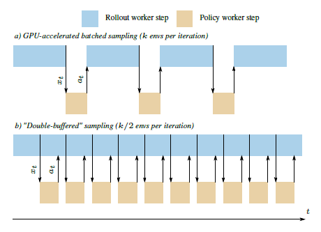

#  Asynchronous-Reinforcement-Learning


## Background
Asynchronous-Reinforcement-Learning is used for the research of network attack and can be used with [EVO-PopulationBasedTraining](https://github.com/yyzpiero/EVO-PopulationBasedTraining).  Asynchronous-Reinforcement-Learning is based on [Sample-Factory](https://github.com/alex-petrenko/sample-factory), which is based on the APPO (Asynchronous Proximal Policy Optimization) algorithm. Sample-Factory is proposed in the paper "Sample Factory: Egocentric 3D Control From Pixels at 100000 FPS with Asynchronous Reinforcement Learning" by Aleksei Petrenko et al. in 2020. It is a high-throughput training system optimized for a single-machine setting and can achieve throughput higher than 100000 environment frames/second on non-trivial control problems in 3D without sacrificing sample efficiency. Asynchronous-Reinforcement-Learning  transform Sample-Factory (1.23.0) to interface  ,with  the same performance as Sample-factory and can support APPO、A3C、IMPALA.


## Features

| Features |  |
| ------ | ------|
| Common interface	| ✔️|
| Custom Environments |  ✔️  |
| Custom policies| ✔️ |
| Documentation    | ✔️|
| State of the art RL methods	| |


## Installation

### Prerequisites 
| #    | Lib | Version |
| ---- | ------ | ------|
| 1    | Python | 3.8.5   |
| 2    | Pytorch| 1.6.0 |
| 3    | Gym    | 0.17.2|

### Installation instructions

1、Download code: `git clone https://github.com/Garytoner/Asynchronous-Reinforcement-Learning.git`

2、Create a conda virtual environment：
```bash
cd Asynchronous-Reinforcement-Learning

conda env create -f environment.yml

conda activate Asynchronous-Reinforcement-Learning
```


## Getting Started
This is an example of how to use Proximal Policy Optimization (PPO) to train and run a Cartpole environment:
```python
from sample_factory.algorithms.appo.appo import APPO
def main():
    env_id = "gym_CartPole-v0"
    device ="gpu"
    model = APPO(env=env_id, device=device, 
                 num_workers=2,
                 num_envs_per_worker=8,
                 encoder='mlp', encodersubtype = 'mlp_mujoco')
        
    model.train(train_for_env_steps=100000)
 
 if __name__ == '__main__':
    main()
```

> APPO can be transformed into A3C or IMPALA
TODO:
### Reinforcement Learning Tips and Tricks
<!---
Yizhou: 一个比较General的建议是，简略说一下A3C、IMPALA为啥变换参数就可以？
-->
### Usage 

```python
model = APPO(env,                                             # training environment
             encoder: str,                                    #  encoding subtype
             encodersubtype:str,                       #  the number of environments that a single actor worker runs
             num_envs_per_worker:int =2,                     #  encoding subtype
             num_workers:int=8,                              # number of actor workers
             device: Union[torch.device, str] = "cpu"，       # device type, if it is cpu, only use cpu, if it is gpu, use both cpu and gpu
             policy_kwargs: Optional[Dict[str, Any]] = None)  #other hyperparameters
```
<!---
Yizhou: 请解释一些这些函数的用处！！！！！
-->
### Get neural network parameters
```
model.get_parameters()
return：neural network parameters
```
### Set neural network parameters
```
model.set_parameters(parameters)
parameters:Dictionary type, the key is policy_id, and the value is the corresponding neural network parameter or checkpoint path
```
### Training
```
model.train(train_for_env_steps)
train_for_env_steps:The number of steps for training
```

## Asynchronous-Reinforcement-Learning's train process

1. First create the learner object, and then start the learner process. In the learner process, start the train_loop thread to calculate the gradient and update the network parameters;

2. Create a policy worker object, and then start the policy worker process;

3. Create the actor worker object. When the object is initialized, the actor worker process is created. When the actor worker object is created, two env_runners are created, and the env_runner is responsible for the specific rollout;

4. First reset actor worker, actor_worker sends a request to policy_worker, policy_worker sends a rollout message to actor_worker after receiving the request, actor_worker enters the awake state after receiving it, and then starts rollout;

5. After the actor_worker runs the step, it sends a request to the policy_worker. After the policy_worker receives the request and processes it, it sends an advance_rollout_request message to the actor_worker. After the actor_worker receives the message and processes it, it runs the step and sends a request to the policy_worker. After a complete rollout, it sends a request to the The leraner sends the train command, the learner starts to prepare the buffer, and puts the experience into the buffer, and the train_loop of the learner periodically processes the data and updates the network parameters. The learner puts the network parameters in the shared memory, and the policy worker periodically updates the network parameters from the shared memory.

6. After N steps of training, the training will end. After the actor worker rollout ends, the corresponding actor worker will be suspended. After all the actor workers are suspended, the training will end.


7. After a train is over, the learner puts the network parameters in the shared memory, and the main process updates the relevant network parameters. Network parameters can be set before each train. The set parameters include `state_dict` and `check_point`, state_dict is network parameters and check_point containts network parameters and other parameters.
<!---
Yizhou: `state_dict` and `check_point` 的解释一些吧，尤其`check_point`
-->

### Example

Here, we use [`gym_maze`](https://https://github.com/MattChanTK/gym-maze) to provide an brief example on how to integrate **customed environment**

1. To compile with the [Sample-Factory](https://github.com/alex-petrenko/sample-factory)， we create a new folder named maze,then we create maze_params.py、maze_utils.py、'__'init__.pyunder this folder.You can create maze_model.py and Readme if it is necessary.

2. To override default traing parameter, it is recommended to build a fucntion `maze_overridedefaults`in maze_params.py.

3. To create maze environment, it is recommended to build a fucntion `make_maze_env` in maze_utils.py.

4. To register maze environment. it is recommended to build a fucntion `maze_funcs` and add `'maze': maze_funcs,` in the function 'register_default_envs' in env_registry.py

In this way,we also custom convolution environment MiniHack but we use `PixelFormatChwWrapper` to transform pixel format.


## Benchmark
The figure below shows the training effect and FPS of Asynchronous-Reinforcement-Learning in Atari PongNoFrameSkip-V4 1024 environment, APPO algorithm train 16 times, each 10 million steps of training.

### training effect

<p>
    
</p>

### FPS

<p>
     
</p>

## Sample-Factory

There are three main computational tasks in a typical RL: environment simulation, model inference, and backpropagation. The design principle is to let the slowest task not wait for other tasks, because the throughput of the system depends on the throughput of the slowest task. Each task corresponds to a type of component. Components communicate through high-speed FIFO queues and shared memory. The three components are: 1) Rollout worker: Each rollout worker can have multiple environment instances, and interact with these environments to collect experience. On the one hand, the Rollout worker passes the experience to the policy worker through the shared memory, and on the other hand, to the learner through the shared memory. 2) Policy worker: Collect the status of multiple rollout workers, get actions through policies, and send them back to rollout workers through shared memory. 3) Learner: Get the experience track from the rollout worker through the shared memory, update the policy, and then send it to the policy worker through the GPU memory (because both the policy worker and the learner run on the GPU). The policy worker can generate actions with the new policy.Rollout worker and policy worker are called sampler subsystem together. In order to solve the problem that the rollout worker waits for the policy worker to return the action, the technique of Double-Buffered Sampling is used. That is, a set of environments is stored on the rollout worker and divided into two groups, and the CPU utilization is improved by taking turns.

<p>
    
</p>

<p>
    
</p>


In this framework, multiple experience trajectories collected from parallel environments in one iteration cannot be digested in one mini-batch by the learner. This will lead to the policy lag problem, that is, the inconsistency between the behavior policy and the target policy. This kind of off-policy learning is more difficult for the PG method. Because the larger the policy lag is, the harder it is to sample from the behavior policy to accurately estimate the gradient. Reducing the number of execution steps in the environment or increasing the mini-batch size can reduce the policy lag. In addition, there are two major techniques used to deal with off-policy learning: trust region (such as PPO clipping) and importance sampling (such as V-trace). Both can be used at the same time. Both are implemented in the Sample Factory.

## Reference
- https://github.com/alex-petrenko/sample-factory.
- https://blog.csdn.net/jinzhuojun/article/details/113796543.
