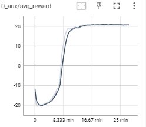
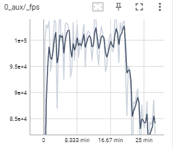
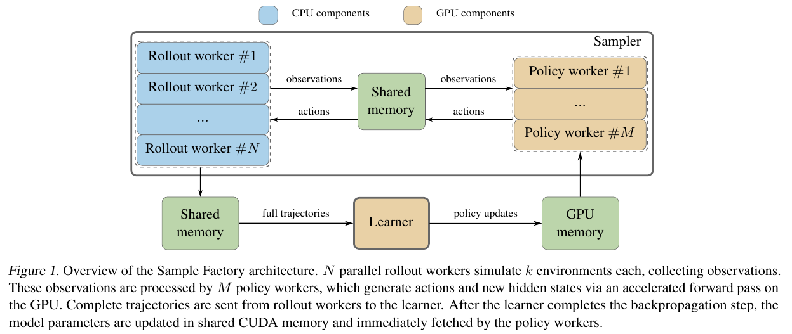
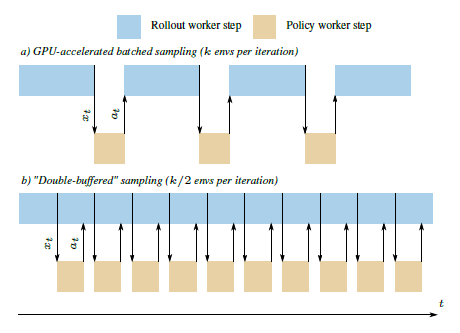

#  Asynchronous-Reinforcement-Learning

## 背景
异步并行算法库接口Asynchronous-Reinforcement-Learning用于网络渗透研究，可以配合[EVO-PopulationBasedTraining](https://github.com/yyzpiero/EVO-PopulationBasedTraining)使用。异步并行算法库接口Asynchronous-Reinforcement-Learning基于2020年Aleksei Petrenko等人的论文《Sample Factory: Egocentric 3D Control From Pixels at 100000 FPS with Asynchronous Reinforcement Learning》提出的[Sample-Factory](https://github.com/alex-petrenko/sample-factory)，它是为单机设计的高吞吐训练系统，基于APPO(Asynchronous Proximal PolicyOptimization)算法。能在3D控制场景达到100000 FPS。异步并行算法库接口Asynchronous-Reinforcement-Learning主要是将Sample-Factory（1.23.0）接口化，性能与Sample-factory相同，支持APPO、A3C、IMPALA三种异步并行算法。

## 安装
### 主要依赖库版本
| #    | 依赖库 | 版本   | 
| ---- | ------ | ------| 
| 1    | Python | 3.8   | 
| 2    | Pytorch| 1.6.0 |
| 3    | Gym    | 0.17.2|

### 安装流程

1、下载代码: git clone https://github.com/Garytoner/Asynchronous-Reinforcement-Learning.git

2、创建conda虚拟环境：

cd Asynchronous-Reinforcement-Learning

conda env create -f environment.yml

conda activate Asynchronous-Reinforcement-Learning

## Asynchronous-Reinforcement-Learning使用说明

### 接口形式

model = APPO(env,encoder: str,encodersubtype:str,num_envs_per_worker:int =2,num_workers:int=8,  device: Union[torch.device, str] = "cpu"， policy_kwargs: Optional[Dict[str, Any]] = None)：其中APPO也可以为A3C或IMPALA，当ppo_clip_ratio=100且ppo_clip_value = 100时，PPO退化为A2C，此时若withvtrace=False，则APPO即退化为A3C，若withvtrace = True时，APPO即退化为IMPALA。因此A3C和IMPALA通过继承APPO实现，不同为若为A3C时，ppo_clip_ratio=100，ppo_clip_value = 100，且withvtrace=False，若为IMPALA时，ppo_clip_ratio=100，ppo_clip_value = 100但withvtrace=Ture.

### 参数说明

param env：训练的环境

param encoder：编码器类型

param encodersubtype：编码子类型

param num_envs_per_worker：单个actor worer 跑的环境数

param num_workers：actor worker 数量

param device：设备类型，若为cpu，则只使用cpu，若为gpu,则同时使用cpu和gpu

param policy_kwargs：其他超参数 

### 获取网络参数

model.get_parameters()

return：神经网络参数

### 设置网络参数

model.set_parameters(parameters)

param parameters:字典类型，键为policy_id，值为对应的神经网络参数或者checkpoint路径

### 训练

model.train(train_for_env_steps)

param train_for_env_steps:一次train的步数 

## Asynchronous-Reinforcement-Learning的train流程

1、首先创建learner对象，然后启动learner进程，在learner进程中，启动了train_loop线程用于计算梯度，更新网络参数；

2、创建policy worker对象，然后启动policy worker进程；

3、创建actor worker对象，在初始化对象时，创建了actor worker进程，在创建actor worker对象时，创建了两个env_runner，env_runner负责具体的rollout；

4、首先reset  actor worker，actor_worker向policy_worker中发送请求，policy_worker收到请求后，向actor_worker发送rollout消息，actor_worker收到后进入awaken状态，然后开始rollout；

5、actor_worker运行step后向policy_worker中发送请求，policy_worker收到请求并进行处理后，向actor_worker发送advance_rollout_request消息，actor_worker收到消息处理后运行step后向policy_worker中发送请求，一次完整的rollout结束后，向leraner发送train命令，learner开始准备buffer，并将经验放入buffer中，learner的train_loop周期性的处理数据并更新网络参数。Learner将网络参数放在共享内存中，policy worker 再从共享内存中周期性更新网络参数。

6.train N步后，训练将结束，actor worker  rollout结束后 ，暂停相应的actor worker，所有的actor worker都暂停后，再结束train.

7、一次train结束后，learner将网络参数放在共享内存中，主进程再更新相关网络参数。在每一次train之前可以设置网络参数，设置的参数有state_dict和check_point两种,均为整体网络参数。

## 训练效果及FPS(Frame per Second)：

下图为异步并行算法库接口AsynRL 在Atari PongNoFrameSkip-V4 1024个环境下， APPO算法 train 16次，每次1000万步的训练的训练效果和FPS。

### 训练效果

    

### FPS

     

## 定制环境

首先判断环境输入是否为图像，若不是图像则使用mlp，若是图像则使用conv，若为图像，则需要wrapper，根据环境类型，一般只需要进行基本的处理，若要定制处理，清参考该环境的官方文档

以XXX环境举例，在异步并行软件库接口中，需要做以下操作：

1：新建以该环境命名的文件夹XXX

2：在该文件夹下新建XXX_params.py和XXX_utils.py

3：在XXX_params.py文件中添加

若该环境处理的是图像，添加

def XXX_override_defaults(env, parser):

parser.set_defaults(

  encoder_type='conv',

​    encoder_subtype='convnet_test',

  )

若该环境处理的不是图像，则添加

def XXX_override_defaults(env, parser):

  parser.set_defaults(

​    encoder_type='mlp',

​    encoder_subtype='mlp_mujoco',   )

  

4：在XXX_utils.py文件中

若该环境处理的是图像，在stable_baseline3中跑该环境，需要做XXXwrapper

添加

import gym

class XXXWrapper():

  .....

  ......

  ......

  

\# noinspection PyUnusedLocal

def make_XXX_env(env_name, cfg=None, **kwargs):

  env = gym.make(env_name)

  env = XXXWrapper(env)

  return env

若该环境处理的不是图像，则添加

import gym

def make_XXX_env(env_name, cfg=None, **kwargs):

  env = gym.make(env_name)

  return env

 

5:在env_registry.py文件中添加

def XXX_funcs():

  from sample_factory.envs.XXX.XXX_utils import make_XXX_env

  from sample_factory.envs.XXX.XXX_params import XXX_override_defaults

return make_XXX_env, None, XXX_override_defaults

在 def register_default_envs(env_registry) 函数  default_envs 后添加 'XXX': XXX_funcs

示例

def register_default_envs(env_registry):

  """

  Register default envs.

  For this set of env families we register a function that can later create an actual registry entry when required.

  This allows us to import only Python modules that we use.

 

  """

 

  default_envs = {

​    'doom_': doom_funcs,

​    'atari_': atari_funcs,

​    'dmlab_': dmlab_funcs,

​    'mujoco_': mujoco_funcs,

​    'MiniGrid': minigrid_funcs,

​    'XXX': XXX_funcs,

  }

## Sample-Factory介绍

一个典型的强化学习中有三个主要的计算任务：环境仿真，模型推理和反向传播。设计的原则是让最慢的任务不要等其它的任务，因为系统的吞吐取决于最慢任务的吞吐。每种任务对应一种类型的组件。组件之间通过高速的FIFO队列和共享内存通信。三种组件分别为：1) Rollout worker：每个rollout worker可以有多个环境实例，与这些环境交互采集经验。Rollout worker一方面将经验通过共享内存给policy worker，另一方面通过共享内存给learner。2）Policy worker：收集多个rollout worker来的状态，通过策略得到动作，通过共享内存传回给rollout worker。3）Learner：通过共享内存从rollout worker拿到经验轨迹，更新策略，然后通过GPU memory（因policy worker与learner都跑在GPU上）发往policy worker。Policy worker就可以用新的策略生成动作了。Rollout worker和policy worker一起称为sampler子系统。为了解决rollout worker等待policy worker返回动作的问题，使用了Double-Buffered Sampling的技巧。即在rollout worker上存一组环境 ，并分成两组，通过轮流来提高CPU利用率。

    

    

在这个框架中，一次迭代中从并行环境中收集的多个经验轨迹在learner中无法在一次mini-batch中消化掉。这会导致policy lag问题，即behavior policy与target policy的不一致。对PG方法来说这种off-policy学习比较困难。因为policy lag越大，从behavior policy采样来准确估计梯度就越难。减少环境中执行步数或者增大mini-batch size可以减少policy lag。除此之外，有两大技术用来处理off-policy学习：trust region（如PPO clipping）和importance sampling（如V-trace）。两者可以同时使用。Sample Factory中两种都实现了。
## 参考
- https://github.com/alex-petrenko/sample-factory.
- https://blog.csdn.net/jinzhuojun/article/details/113796543.
